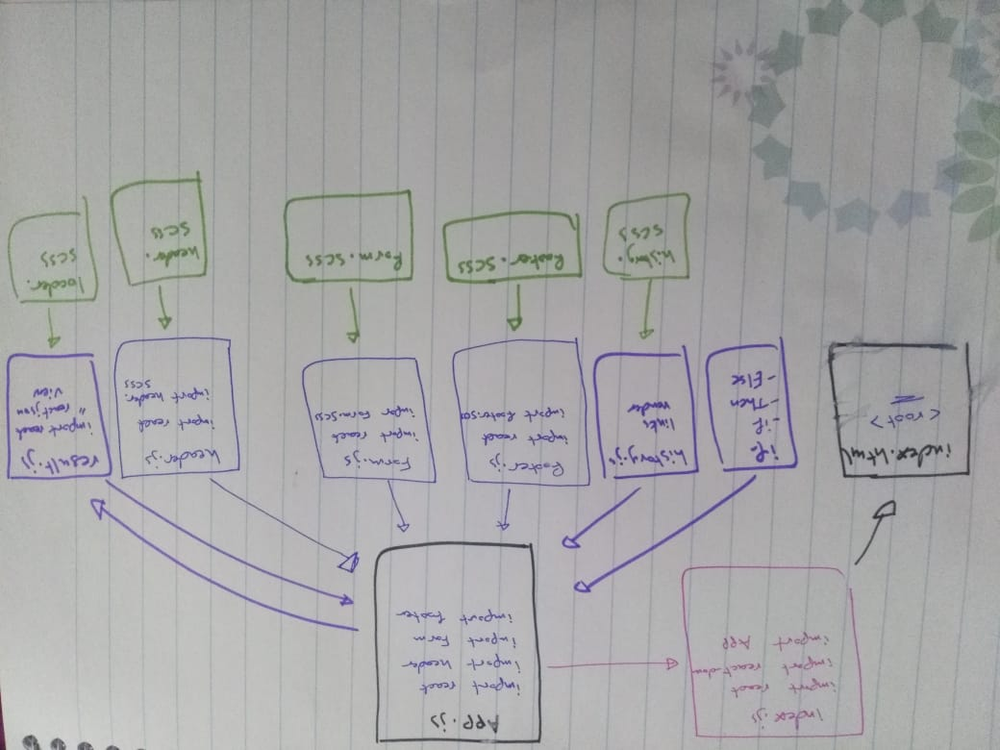

# RESTy-

## Author : Israa Othman 

## Links :
  [lab26 PR](https://github.com/401-advanced-javascript-israaOthman/resty/pull/1)  
  [lab27 PR](https://github.com/401-advanced-javascript-israaOthman/RESTy-/pull/2)  
  [lab28 PR](https://github.com/401-advanced-javascript-israaOthman/RESTy-/pull/6)  
  [lab29 PR](https://github.com/401-advanced-javascript-israaOthman/RESTy-/pull/5)  

## How to initialize/run your application (where applicable)
  - `npm run start`  

## UML 
 
 

## Deployment 
 - [gh-pages](https://401-advanced-javascript-israaothman.github.io/RESTy-/)
 - [Netlify](https://adoring-pike-2234f9.netlify.app/)
